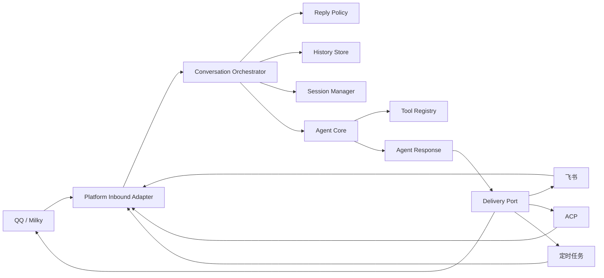

# Agent 与平台解耦设计

状态：P0/P1/P2 基础边界、P3 工具能力注入和 QQ 生产切换已实施；飞书接入方案已文档化并保留为隔离参考，当前开发主线暂不继续扩展飞书。

当前实现进度（2026-10-03）：

- P0 已落地：`utils/agent_protocol/` 提供平台无关值对象、Agent 请求/结果和应用端口，并有导入边界测试。
- P1 已落地：`AgentRuntimeRequest`、`FrontierRuntimeContext` 和 `FrontierCognitive` 接受中性会话、参与者、能力和 workspace key；旧 QQ/ACP 调用保持兼容。
- P2 已落地：`ConversationOrchestrator` 定义中立的历史→门控→Agent→投递生命周期；`plugins/agent/adapters/qq.py` 提供可注入的 QQ message、history、reply policy、delivery 和 tool facade，并已接入 QQ 生产入口。
- P3 已落地：工具注册器为 QQ/Milky 模块声明 capability，`FrontierCognitive` 按显式能力筛选 direct 工具快照（原 direct/PTC 双通道已随 quickjs 解释器一同移除）；QQ 入口声明中性会话、参与者、workspace 和 `platform:qq` 能力。`FrontierAgentCore` 将中性 `AgentRequest` 桥接到现有 runtime；群聊和私聊的文本、已下载媒体、当前已暂存文件、已解析引用、已完成 hydration 的近期媒体和 session 统一进入编排层。旧 `qq_text_canary_enabled` 字段只保留配置兼容性，不再控制路由。
- 飞书方案已单独文档化：`plugins/agent/adapters/feishu*.py` 保留为无 SDK 的边界参考和契约测试，`plugins.agent` 不会自动注册它，当前不把它作为生产接入主线。后续若重新启动飞书工作，再由独立宿主显式注册 lifecycle，并按本文 P4/P5 补持久化 history、durable queue、加密解码和媒体能力。

目标：在保留 QQ/Milky 现有行为的前提下，把 Agent 执行和平台接入拆开，使飞书等新平台可以复用同一套 Agent、工具编排、workspace、memory、session 和执行控制。

本文是 Frontier 的目标架构和迁移约束。它不要求一次性重写现有 `plugins/agent`、`utils/database.py` 或工具注册器。

## 0. 渐进式执行流程

每个阶段都遵循同一条闭环：

1. 先增加中性协议或 facade，不改变现有生产入口。
2. 用 fake Agent、fake 平台和回放数据验证边界、身份隔离、投递结果和历史语义。
3. 让新路径以 shadow/canary 方式运行，比较旧路径与新路径的门控、workspace、工具集合和投递结果。
4. 生产切换后由中性编排器统一处理入口；Core 启动后不重跑旧 Agent，避免重复工具副作用或重复投递；已经送达的平台消息也不回滚。
5. 观察一轮稳定性和资源指标后，再扩大消息类型、媒体能力和工具能力。
6. 第二个平台稳定运行后，才删除兼容字段或评估数据库泛化。

本次执行已经完成 P0～P3，并完成 QQ 统一编排层的生产切换；飞书适配器方案及边界写入文档，飞书持久化 history、durable queue 和真实平台验证暂时冻结。

## 1. 背景与当前边界

当前项目已经有一个可复用的运行入口：[`utils/agents/runtime_gateway.py`](../utils/agents/runtime_gateway.py)。但请求模型仍包含 `group_id`、`group_member_role` 等 QQ 概念，Agent 输出还会转换为 `UniMessage`。

QQ 入口 [`plugins/agent/handlers.py`](../plugins/agent/handlers.py) 同时负责：

- Milky 事件解析和消息归一化；
- 回复门控、唤醒词和群聊策略；
- 媒体下载、附件索引和引用解析；
- 历史读取、Agent 执行、session 租约；
- 文本/媒体投递以及已送达消息落库。

消息发送逻辑 [`utils/message.py`](../utils/message.py) 也同时包含 Markdown 渲染、内容安全、`UniMessage` 构造和 Milky 投递。

这使得增加飞书时容易出现以下问题：

1. 飞书事件类型渗透到 Agent Core；
2. QQ 的整数 ID、群聊语义和飞书的字符串 ID 相互污染；
3. Agent 生成结果绑定某个平台的消息对象；
4. QQ 专属工具被错误暴露给其他平台；
5. 为支持新平台而被迫迁移整个消息数据库。

## 2. 设计依据

本设计结合以下项目的边界经验：

- [LangBot 架构](https://github.com/langbot-app/LangBot/blob/master/ARCHITECTURE.md)：平台层把外部事件转换成共享消息模型，不包含 LLM 业务逻辑；
- [LangBot 平台适配器说明](https://github.com/langbot-app/LangBot/wiki/en-workshop-impl-platform-adapter)：通过事件转换器和消息转换器实现双向适配；
- [Rasa Channel API](https://legacy-docs-oss.rasa.com/docs/rasa/reference/rasa/core/channels/channel/)：使用 `InputChannel`、`UserMessage`、`OutputChannel` 分离输入和输出；
- [NoneBot 适配器规范](https://nonebot.dev/docs/developer/adapter-writing)：平台接入由 Adapter、Bot、Event、Message 组成；
- [LangGraph Runtime Context](https://github.com/langchain-ai/docs/blob/main/src/oss/langgraph/graph-api.mdx)：把本次执行的身份、能力和依赖放入运行时 context；
- [DeepAgents 架构](https://github.com/langchain-ai/deepagents/blob/main/libs/ARCHITECTURE.md)：区分 Agent 构建阶段和执行阶段。

Frontier 不直接复制这些项目的全部结构，而是采用其中共同的原则：**平台负责转换，应用层负责编排，Agent Core 负责推理，基础设施通过端口注入。**

## 3. 目标架构



### 3.1 分层职责

| 层 | 负责内容 | 不负责内容 |
| --- | --- | --- |
| Platform Adapter | 事件解析、平台 ID、平台 API、平台消息转换 | 模型调用、Agent 图、通用历史规则 |
| Application Orchestrator | 去重、门控、排队、历史快照、执行、投递结算 | 具体平台 API、模型提示词细节 |
| Agent Core | 模型、工具编排、middleware、workspace、memory、session 执行 | `MessageEvent`、`UniMessage`、Milky/飞书 SDK |
| Infrastructure | SQLite、文件系统、HTTP、LLM provider、渲染器 | 平台事件语义和 Agent 决策 |

依赖方向固定为：

```text
platform adapter → application → agent core
infrastructure ─────────────────┘
```

Agent Core 不得反向依赖平台适配器。

## 4. 统一领域模型

统一模型只使用标准库类型和项目自己的值对象。平台的原始事件只能停留在适配器内部。

### 4.1 会话身份

```python
@dataclass(frozen=True, slots=True)
class ConversationRef:
    platform: str                 # qq / feishu / acp / scheduled
    account_id: str               # 机器人或应用账号
    kind: str                     # direct / group / channel / thread
    conversation_id: str
    tenant_id: str | None = None
    parent_id: str | None = None
```

所有 ID 都按不透明字符串处理。不得在 Agent Core 假设 ID 是整数，也不得使用 `None` 同时表示私聊、未知会话和缺失字段。

工作区 key 必须包含平台和账号，例如：

```text
qq:{account_id}:group:{conversation_id}
qq:{account_id}:direct:{conversation_id}
feishu:{tenant_id}:chat:{conversation_id}
feishu:{tenant_id}:thread:{conversation_id}
```

这同时适用于 workspace、session、checkpoint、历史范围和缓存指标。

### 4.2 参与者和消息

```python
@dataclass(frozen=True, slots=True)
class Participant:
    id: str
    display_name: str
    role: str | None = None
    permissions: frozenset[str] = frozenset()


@dataclass(frozen=True, slots=True)
class MessageRef:
    platform: str
    conversation: ConversationRef
    message_id: str


@dataclass(frozen=True, slots=True)
class InboundMessage:
    message_id: str
    conversation: ConversationRef
    sender: Participant
    created_at: datetime
    parts: tuple["MessagePart", ...]
    reply_to: MessageRef | None = None
    mentions_agent: bool = False
    metadata: Mapping[str, object] = field(default_factory=dict)
```

`metadata` 只承载经过筛选的非敏感平台信息。原始 Milky/飞书事件对象、平台 token 和完整 payload 不进入 Agent 请求。

### 4.3 内容片段

```text
TextPart
ImagePart
AudioPart
VideoPart
FilePart
MentionPart
QuotePart
```

平台适配器负责把平台消息片段转换为这些类型。Agent Core 只处理统一内容，不判断某个平台的 segment type。

### 4.4 Agent 请求和结果

```python
@dataclass(frozen=True, slots=True)
class AgentRequest:
    request_id: str
    current: InboundMessage
    history: tuple["ChatMessage", ...]
    workspace_key: str
    capabilities: frozenset[str]
    execution_profile: str
    allow_silent_reply: bool = False
    session_turn: object | None = None


@dataclass(frozen=True, slots=True)
class AgentArtifact:
    kind: str                    # image / audio / video / file
    data: bytes
    mime_type: str
    name: str | None = None
    url: str | None = None       # optional remote source for URL-backed tools
    path: str | None = None      # optional local source for path-backed tools


@dataclass(frozen=True, slots=True)
class AgentResponse:
    text: str
    artifacts: tuple[AgentArtifact, ...] = ()
    status: str = "success"
    should_reply: bool = True
    run_id: str | None = None
    usage: Mapping[str, object] = field(default_factory=dict)
```

`AgentResponse` 不得包含 `UniMessage`、Milky receipt、飞书 SDK 对象或任何可直接发送的平台对象。

## 5. 应用层端口

不要设计一个包含几十个方法的万能 `PlatformAdapter`。按责任拆成多个端口。

```python
class ReplyPolicy(Protocol):
    async def decide(
        self,
        message: InboundMessage,
        history: Sequence[ChatMessage],
    ) -> GateDecision: ...


class HistoryStore(Protocol):
    async def load(self, query: HistoryQuery) -> list[ChatMessage]: ...
    async def append(self, message: StoredMessage) -> None: ...


class DeliveryPort(Protocol):
    async def send(
        self,
        target: ConversationRef,
        response: AgentResponse,
    ) -> DeliveryReceipt: ...


class PlatformToolProvider(Protocol):
    def tools(
        self,
        capabilities: frozenset[str],
    ) -> Sequence[BaseTool]: ...
```

### 5.1 `ReplyPolicy`

负责平台和产品策略：

- 是否允许该用户或会话访问；
- 是否需要 @ 或唤醒词；
- 是否使用 Decision LLM 判断主动回复；
- 群聊和私聊的回复策略；
- 当前消息是否应被忽略。

QQ 的 `message_gateway()` 迁移为 `QqReplyPolicy`。飞书可以实现不同的 mention、私聊和群聊规则。Agent Core 不应知道唤醒词或 `event.is_tome()`。

### 5.2 `HistoryStore`

第一阶段不迁移整个数据库。先包一层：

```python
class QqHistoryStore:
    def __init__(self, database: MessageDatabase):
        self.database = database

    async def load(self, query: HistoryQuery) -> list[ChatMessage]:
        ...

    async def append(self, message: StoredMessage) -> None:
        ...
```

然后新增 `FeishuHistoryStore`。Agent Core 只依赖 `HistoryStore`，不直接调用 `MessageDatabase`。

待第二个平台稳定后，再评估数据库是否需要通用字段：

```text
platform
account_id
tenant_id
conversation_kind
conversation_id
message_id
sender_id
content_parts
```

当前 QQ 表结构、FTS 和附件路径不在第一阶段迁移范围内。

### 5.3 `DeliveryPort`

投递接口必须支持：

- 文本；
- `AgentArtifact`；
- 回复引用；
- 部分成功；
- 失败和结果不确定；
- 平台返回的不透明消息 ID。

建议把现有只统计数量的 `DeliveryResult` 逐步扩展为逐项 receipt：

```python
class DeliveryStatus(StrEnum):
    DELIVERED = "delivered"
    FAILED = "failed"
    UNKNOWN = "unknown"


@dataclass(frozen=True, slots=True)
class DeliveryReceipt:
    status: DeliveryStatus
    message_refs: tuple[MessageRef, ...] = ()
    errors: tuple[str, ...] = ()
```

核心层不能因为投递失败而自动重跑整轮 Agent。平台适配器只能重试明确安全的单条投递。

## 6. Conversation Orchestrator

当前 `plugins/agent/handlers.py` 的主流程应逐步收敛到一个平台无关的编排器：

```python
class ConversationOrchestrator:
    async def handle(
        self,
        message: InboundMessage,
        *,
        policy: ReplyPolicy,
        history: HistoryStore,
        delivery: DeliveryPort,
        tools: PlatformToolProvider | None = None,
    ) -> TurnOutcome:
        ...
```

标准流程保持现有语义：

```text
normalize
→ deduplicate
→ history snapshot
→ reply policy
→ delivery queue
→ session lease
→ Agent execution
→ content safety
→ artifact/text delivery
→ append only delivered history
→ settle session lease
```

其中：

- 平台适配器决定如何 normalize；
- `ReplyPolicy` 决定是否进入 Agent；
- `HistoryStore` 提供消息快照；
- `Agent Core` 只执行当前请求；
- `DeliveryPort` 决定平台如何发送；
- `PlatformToolProvider` 提供平台专属工具；这些工具会沿着
  `AgentRequest → AgentRuntimeRequest` 传入 Agent 图，并按名称去重，避免与
  capability 快照重复注册；
- 只有实际送达的结果才进入 assistant 历史。

这保留 Frontier 当前的“先门控、后下载媒体”和“送达后落库”语义。

## 7. Agent Core 和 Runtime Context

`FrontierCognitive` 继续负责构建模型、middleware、工具和 subagent，但需要逐步移除平台依赖：

```python
@dataclass(frozen=True, slots=True)
class AgentRuntimeContext:
    principal: Participant
    conversation: ConversationRef
    workspace_key: str
    capabilities: frozenset[str]
    platform_services: object | None = None
```

LangGraph 的 graph state 保存消息和执行状态；runtime context 保存本次请求的身份、权限、workspace 和能力。不要把平台客户端、token 或可变的请求对象写进长期 checkpoint。

Agent Core 禁止直接导入：

```text
nonebot
nonebot.adapters.milky
UniMessage
get_bot()
MessageDatabase
```

当前 [`utils/agents/cognitive.py`](../utils/agents/cognitive.py) 中的多媒体工件提取产生 `AgentArtifact`，由 QQ/飞书 Delivery 负责把内联字节、URL 或本地路径转换为平台消息。

## 8. 工具和能力注册

工具分为三类：

```text
common
  memory / weather / paint / video / web search / document analysis

platform
  qq.send_message
  qq.get_group_member
  qq.set_group_name
  feishu.send_message
  feishu.get_chat_members

internal
  workspace / session / diagnostics
```

工具元数据至少包含：

```python
@dataclass(frozen=True, slots=True)
class ToolSpec:
    name: str
    platform: str | None
    required_capabilities: frozenset[str]
    read_only: bool
    has_side_effects: bool
    retry_policy: str
```

`tools/milky_*` 归入 QQ 工具提供者，不再作为所有入口的默认工具。通用工具可以被不同平台共享，平台写操作必须显式声明 capability。

## 9. 平台适配器布局

目标布局可以先以兼容方式增加，不要求一次性移动现有代码：

```text
utils/agent_protocol/
  models.py
  ports.py
  identity.py

application/
  orchestrator.py
  policies.py

plugins/agent/qq/
  inbound.py
  policy.py
  history.py
  media.py
  delivery.py
  tools.py

plugins/agent/feishu/
  inbound.py
  policy.py
  history.py
  media.py
  delivery.py
  tools.py
```

当前目录的迁移映射：

| 当前模块 | 目标职责 |
| --- | --- |
| `plugins/agent/handlers.py` | QQ Adapter + Orchestrator 调用入口 |
| `plugins/agent/gateway.py` | `QqReplyPolicy` |
| `plugins/agent/reply_context.py` | QQ 消息和引用转换 |
| `plugins/agent/attachments.py` | `QqMediaResolver` |
| `utils/message.py` | 共享渲染能力 + `QqDelivery`，逐步拆开 |
| `utils/agent_orchestration.py` | 过渡期 `ConversationOrchestrator`，稳定后可移到 application 层 |
| `plugins/agent/adapters/qq.py` | `QqMessageAdapter`、`QqReplyPolicy`、`QqHistoryStore`、`QqDelivery`、`QqToolProvider` facade |
| `utils/agents/runtime_gateway.py` | Agent Service 的兼容入口 |
| `utils/agent_context.py` | 通用 `AgentRuntimeContext` |
| `tools/milky_*` | QQ `PlatformToolProvider` |
| `utils/database/` | QQ `HistoryStore` 的底层实现 |

## 10. 配置边界

通用配置放在 Agent 层：

```toml
[agent]
model = "..."
capability = "..."
job_timeout_seconds = 300

[platforms.feishu]
enabled = false
```

当前配置 schema 只为新接入的 Feishu 暴露 `[platforms.feishu]`；QQ 的既有白名单、唤醒词和 Milky 设置仍由现有配置段管理，待第二个平台稳定后再统一命名。

平台配置负责：

- token、app id、webhook；
- 平台白名单和黑名单；
- mention、回复和媒体限制；
- 平台专属工具开关。

Agent Core 不读取 `AGENT_WHITELIST_GROUP_LIST` 这类 QQ 专属配置。

## 11. 迁移阶段

### P0：协议和依赖边界

新增：

```text
utils/agent_protocol/models.py
utils/agent_protocol/ports.py
utils/agent_protocol/identity.py
```

完成统一模型、端口和导入边界测试。不改变 QQ 行为。

### P1：Runtime 兼容改造

- `AgentRuntimeRequest` 增加 `ConversationRef`；
- `group_id`、`group_member_role` 进入兼容转换层；
- 中性输出使用 `utils.agent_protocol.AgentResponse` / `AgentArtifact`；旧 `AgentRuntimeResult` 继续保留给 ACP 等兼容调用；
- 保留旧 `.run()`，避免 ACP、定时任务和现有测试同时迁移。

### P2：QQ 适配器和应用编排

新增 QQ facade：

```text
QqMessageAdapter
QqReplyPolicy
QqHistoryStore
QqDelivery
QqToolProvider
```

当前已包装现有实现，并增加 `ConversationOrchestrator`。Milky 事件解析和下载编排仍由 `handlers.py` 承担；`QqMessageAdapter` 已接管中性身份、当前/近期已解析媒体、文件和引用的 `InboundMessage` 构造，以及 history→`ChatMessage` 转换。QQ 入口已完成生产切换，旧执行函数只作为显式兼容 helper 保留，不参与正常路由。

### P3：工具能力注入

已完成第一步：`tools/__init__.py` 为 QQ/Milky 模块提供 capability 元数据和按能力筛选的 direct 快照；显式传入 `qq`、`platform:qq` 或 `qq:tools` 时开放完整 QQ 工具，细分能力可只开放消息、文件、好友、群管理或系统工具。空 capability 仍保持旧调用的全量行为。

QQ `handlers.py` 已通过 `AgentRuntimeRequest` 注入中性身份和 `platform:qq` 能力；群聊和私聊的当前文本、已下载媒体、当前已暂存文件、解析中的引用、已完成 hydration 的近期媒体和 session 统一进入 `ConversationOrchestrator`，session 租约在中性投递成功或静默结果后结算。网关仍在媒体下载前执行，编排器复用已准备的历史快照和延迟群回复策略；近期附件按独立字段传入，不会误混入当前请求；Agent 执行后不重跑旧 Agent，避免重复工具副作用或重复投递。平台工具提供器选出的工具会继续传入 runtime，和能力快照中的同名工具只保留一份。

### P4：飞书最小闭环（暂缓，作为参考设计）

第一版只支持：

```text
飞书文本事件
→ InboundMessage
→ AgentRequest
→ Agent Core
→ 飞书文本回复
```

暂不支持飞书图片、文件、复杂引用、会话缓存和平台管理工具。

当前仓库保留 `FeishuMessageAdapter`、`FeishuWebhookConnector`、`FeishuApiClient` 和可选 FastAPI 包装作为边界参考与契约样例；`plugins.agent` 不会自动挂载它们。若重新启动该阶段，应由独立宿主显式注册 lifecycle，并补齐跨重启 durable history/queue、AES 解码器、真实平台验证和媒体能力。API 约定见[tenant access token 文档](https://open.feishu.cn/document/server-docs/authentication-management/access-token/tenant_access_token_internal)和[发送消息文档](https://open.feishu.cn/document/server-docs/im-v1/message/create)。

Webhook 的 challenge、Verification Token 和事件签名按[飞书事件订阅回调文档](https://feishu.apifox.cn/doc-7518444)实现；加密 payload 的 AES 解码器保持由 host connector 注入，避免把平台 SDK 或密码学依赖带进中性 facade。

### P5：媒体、线程和历史

如果重新启动飞书宿主，文本闭环稳定后，再加入：

- 图片和文件；
- 飞书线程；
- 引用消息；
- session/checkpoint；
- 飞书专属工具；
- 富文本或卡片输出。

### P6：数据库泛化评估

只有第二个平台完成实际运行后，才决定是否把现有 QQ 数据库迁移为通用消息存储。第一阶段的目标不是重做数据库，而是验证端口边界。

## 12. 测试和验收

### 12.1 核心 Agent 测试

Agent Core 使用 fake platform，不启动 NoneBot，不导入 Milky：

```text
test_agent_accepts_generic_conversation
test_agent_returns_neutral_artifacts
test_agent_uses_runtime_capabilities
test_agent_does_not_require_platform_sdk
test_agent_preserves_progress_events
```

### 12.2 平台适配器契约测试

QQ 和飞书适配器都应通过同一套抽象测试：

```text
test_normalize_text_message
test_preserve_opaque_message_id
test_map_direct_and_group_conversation
test_map_mentions
test_map_reply_reference
test_send_text
test_send_artifact
test_partial_delivery
test_unknown_delivery_result
test_duplicate_event
test_history_scope_isolation
```

### 12.3 静态依赖检查

CI 增加导入边界检查，禁止 `utils/agents/**` 引入：

```text
nonebot
nonebot.adapters.milky
UniMessage
get_bot
MessageDatabase
```

### 12.4 必须保持的现有语义

- 网关在媒体下载之前运行；
- 当前消息和历史消息的时间边界不变；
- 只有实际送达的 assistant 内容才进入历史；
- 平台写操作失败不自动重跑整轮 Agent；
- session 租约覆盖生成、审核、投递和落库；
- 不同平台、账号、租户和会话不能共享 workspace 或 checkpoint。

## 13. 非目标和禁止事项

第一阶段不做：

- 一次性重写 `utils/database.py`；
- 把所有平台能力抽象成一个万能 API；
- 把原始平台事件放进 Agent prompt；
- 让 Agent Core 直接发送消息；
- 让通用工具依赖具体 Bot SDK；
- 为了新平台复制一份完整 Agent 图；
- 在飞书 MVP 阶段实现所有富媒体和管理功能；
- 在没有回放测试的情况下删除 QQ 兼容入口。

## 14. P0/P1 第一份实现 PR 的范围

第一份 PR 只做以下内容：

1. 新增 `utils/agent_protocol/models.py`；
2. 新增 `utils/agent_protocol/ports.py`；
3. 新增 `utils/agent_protocol/identity.py`，集中处理 workspace key 的安全归一化；
4. 定义 `ConversationRef`、`Participant`、`MessageRef`、`InboundMessage`、`AgentRequest`、`AgentArtifact`、`AgentResponse`；
5. 让 `utils/agents/runtime_gateway.py` 能接受新模型，同时保留旧调用方式；
6. 增加 fake delivery 和核心协议测试；
7. 增加 CI 导入边界检查；
8. 不改变 QQ 的实际发送、历史和工具行为。

完成条件：现有 QQ 测试通过，Agent Core 可以在没有 NoneBot/Milky 的测试进程中完成一次文本请求和中性工件返回。
