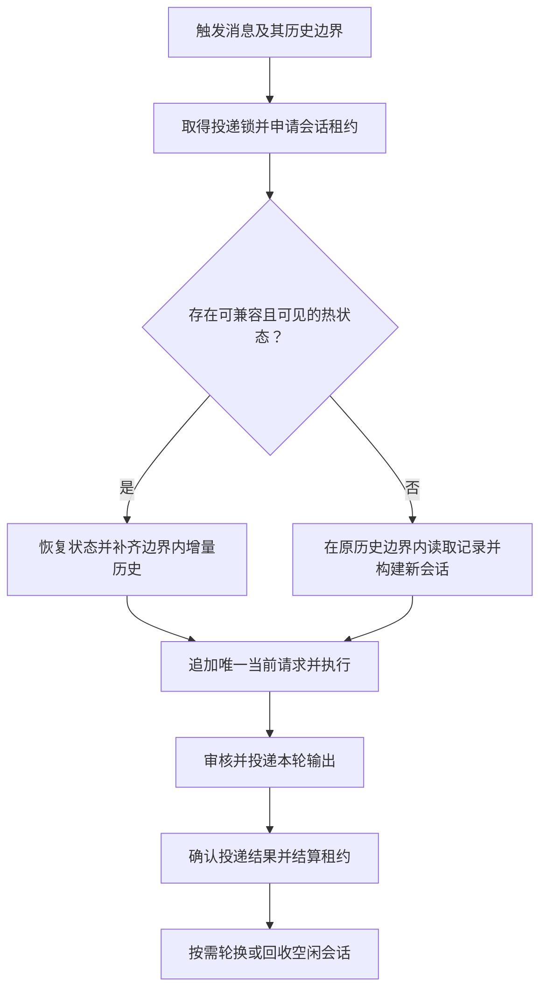

# 有界 Checkpointer 与会话重建实施计划

状态：已实施，默认关闭。设计基线及实现日期：2026-09-10。启用方式、实现取舍与验证记录见 [QQ 会话缓存](agent-sessions.md)。本文保留设计背景和验收范围。

目标：连续对话复用 Agent 状态；空闲过期后释放 checkpoint，下一次触发时从聊天数据库重建上下文。同时限制长时间活跃会话的存储增长，保留现有消息隔离、调用预算和投递语义。

## 1. 改造前行为与设计约束

- [cognitive.py](../utils/agents/cognitive.py) 每轮创建图，尚未传入 `checkpointer`；已有 `thread_id` 不会自动产生跨轮记忆。
- [runtime.py](../utils/agents/runtime.py) 的 thread ID 按“群＋用户”划分，workspace 和 QQ 投递锁按群共享。接入状态前须明确这两种身份的关系。
- [chat_context.py](../plugins/agent/chat_context.py) 每轮拼接历史与当前请求。启用 checkpointer 后不能继续无条件追加整段历史。
- [message_flow.md](message_flow.md) 规定历史是消息到达时的快照。排队后的新问题、以及用户发送请求时尚未看到的助手回复，不得混入该请求。
- QQ 最终回复在审核、发送成功后才写入数据库；图生成完成不等于用户已经收到。
- `extract_uni_messages()` 当前扫描全部返回消息。跨轮保留状态后，必须增加当前轮边界，避免再次发送旧媒体。
- 当前 Deep Agents 的 `messages` 使用 `DeltaChannel`。最新 checkpoint 可能依赖祖先记录和中间写入，不能直接截取最后 N 个 checkpoint。
- 当前 Deep Agents 摘要机制保留原始 `state.messages`，仅缩短模型实际看到的上下文。摘要与存储回收必须分别设计。

第一版采用进程级共享 `InMemorySaver`，在其外部增加会话管理和容量控制。继续使用现有聊天数据库作为已发生对话的事实来源，不增加聊天数据库迁移，不实现跨进程恢复、时间旅行或旧任务自动续跑。ACP、定时任务第一版保持独立执行，不接入 QQ 热会话；会话标识预留独立来源命名空间。

## 2. 分开管理三个预算

| 预算 | 控制内容 | 实现位置 |
| --- | --- | --- |
| 上下文预算 | 跨轮历史、摘要、历史工具结果实际占用的 token | 上下文构造与模型请求中间件 |
| 存储预算 | checkpoints、中间 writes、序列化媒体和其他状态的累计占用 | saver 适配层与 SessionManager |
| 生命周期预算 | 空闲时间、常驻会话数、每代累计完成轮数 | SessionManager |

只裁剪模型输入不能释放旧 checkpoint；只设 TTL 不能限制一直活跃的群。消息条数也不能代替 token 或字节预算。

上下文采用浮动预算加绝对上限：按模型 profile 计算可用输入空间，扣除系统提示词、工具声明、当前请求和必要安全余量，再限制历史所占比例。优先保留当前请求及最近完整对话，旧内容按需摘要、截断或转换为文件引用。历史预算不足时减少历史，不静默删除当前问题。

保留现有当前／引用／历史媒体预算。跨轮历史预算不替代单轮模型、工具、PTC 调用上限，也不替代整轮超时与 Deep Agents 的总上下文保护。

## 3. 会话身份与最小数据结构

建议新增 `utils/agents/sessions.py`，管理以下数据，不保存模型对象、密钥或完整请求日志：

| 对象 | 必要字段与职责 |
| --- | --- |
| `SessionKey` | 来源、机器人账号、会话类型、群 ID 或私聊对端 ID |
| `SessionEntry` | 当前代次、thread ID、状态、最后结束时间、完成轮数、容量计数、兼容性指纹 |
| `HistoryBoundary` | 当前消息数据库 ID、既有时间截止条件、消息到达时的历史可见边界 |
| `TurnLease` | 本轮 run ID、会话代次、当前输入身份、输出消息／工件身份、等待投递状态 |
| 初始消息 | 首次／轮换后的请求在执行前按原边界从 DB 构造有界输入；不增加常驻 `ConversationSeed` |

实际 thread 标识复用现有 workspace 名称：

```text
qq:{bot_id}:group-{group_id}:generation:{generation_id}
qq:{bot_id}:dm-{user_id}:generation:{generation_id}
```

同一群的不同成员共享对话状态；不同机器人、不同群、不同私聊隔离。这个变化不扩大 workspace 的文件权限，不能从旧状态继承上一位发言人的群管理权限。没有可信机器人身份的调用不进入 QQ 热缓存。

会话管理器和 saver 的生命周期覆盖整个应用进程，不依赖临时 `FrontierAgentRuntime` 实例存活。仍可按请求构建图，使用同一个 saver；不将带有某次请求身份、受限工具或权限的图无条件全局复用。

## 4. 冷启动、热续接与历史边界



### 4.1 冷启动

1. 首次触发、空闲过期、容量淘汰、进程重启、旧状态失效时进入冷启动。
2. 从 DB 读取本次请求原本可见的近期历史。复用现有消息归一化、引用解析与附件权限检查。
3. 历史按 token 预算选择，当前消息只追加一次。未达到压缩阈值时不额外调用模型生成摘要。
4. 为新代次建立初始输入，由正常图执行产生 checkpoint，不直接构造底层 checkpoint、channel version 或 pending writes。
5. 不伪造旧工具调用、不自动恢复旧 todos 或待执行操作。历史只能恢复对话背景，不能完整重建旧执行现场。

### 4.2 热续接

- 使用稳定的 LangChain 消息 ID，关联数据库消息身份、机器人和会话来源。维护模型最终输出 ID 与已发送 assistant 记录 ID 的映射，避免同一回复由 checkpoint 和 DB 各注入一次。
- 补齐上次处理后新增、且在本轮历史边界内的群消息，包括未触发 Agent 的消息。增量查询在实际执行时进行，但不能突破消息到达时的快照。
- 保留“历史仅作背景、只回应当前请求”的约束；消息身份和请求目标通过显式字段传递，不从文本猜测。
- 不能仅用 `time > last_time` 或 `id > last_id` 决定当前输入是否需要处理。消息可能同毫秒、延迟入库，排队请求也可能早于刚完成回复的数据库 ID。
- 当前输入是否执行、哪些历史已经覆盖、哪些助手输出已投递，分别记录。当前请求必须显式加入，即使它的数据库 ID 小于某条已处理记录。
- 历史 ID 集合只保留当前代次必要范围；被摘要覆盖的范围使用独立元数据表示，不能因为原消息被裁剪就把它们重新注入。

### 4.3 排队请求与热状态冲突

若热状态已包含本轮消息到达之后才生成或送达的内容，不能直接续接。第一版采用确定性回退：使该热代次失效，为本轮在原快照边界内创建新代次。

例如：用户 B 在 A 的回复发送前提问；等 B 出队时，A 的回复已进入热状态。B 本轮仍使用到达时可见的历史，不加入 A 的新回复。后续在 A 回复送达之后发出的请求，才可从 DB 补入它。

该策略会降低繁忙群聊的缓存命中率，但保留现有产品行为。若以后要改变排队语义，应单独修改消息流约定与测试。

DB 历史查询须同时保证机器人和会话范围隔离。对于无法确认机器人归属的旧记录，不通过宽泛匹配混入另一机器人的缓存；不为此恢复已删除的迁移逻辑。

## 5. 执行、投递与状态结算

会话状态建议为 `idle → running → awaiting_delivery → idle`；异常路径进入 `invalidated`，终止使用旧代次。

- QQ 入口持有跨“生成＋审核＋发送＋历史记录”的 `TurnLease`。`managed_agent_turn` 返回后不能立即将会话标为可回收。
- 保持 `delivery → workspace` 锁顺序。租约元数据更新使用短临界区；不持有全局管理锁等待 workspace 或网络操作。
- checkpoint 更新、失效和轮换在对应 workspace 串行边界内完成。清理器须再次确认代次和租约仍匹配，不删除刚被新请求占用的状态。
- 为本轮输出记录稳定消息／tool call／工件身份；工件提取只接收当前轮新增输出。不能依靠原始列表下标，因为摘要和消息替换可能改变列表。
- 图生成成功后，最终 AI 内容仍为待投递状态。只有审核、发送成功后，才以实际送达文本校准会话。
- 已送达且 DB 写入成功：关联消息 ID，结算租约。
- 已送达但 DB 写入失败：不再次发送；保留可识别的投递事实，记录告警。明确冷重建可能缺失这条回复，不把缓存当作持久化保证。
- 文本或附件部分失败：记录各自投递结果，不重发已成功部分；若不能可靠校准图状态，失效该代次并在下一轮重建。
- `silent` 结果正常结束本轮，不虚构 assistant 回复；下一轮清除 `suppress_reply` 等临时字段。
- 超时、取消、预算耗尽、写操作结果不确定：继续采用现有错误语义，不恢复执行旧图、不重新运行整轮。释放租约并使不完整状态失效；已发生的外部操作不会回滚。
- 第一版不承诺人工审批中断的跨轮恢复。遇到未完成的中断任务不能当作普通 `idle` 会话淘汰或自动继续；进入明确失败／失效路径。未来支持审批时另行引入持久化 saver 与恢复协议。

媒体在热状态中优先保存虚拟路径和必要描述。原始 bytes、`UniMessage` 工件通过当前轮工件容器和明确的序列化适配处理，避免不可序列化对象或重复大对象长期驻留；不得依靠全局开启 pickle 兜底。附件过期时使用现有“附件已过期”语义。

每次输入重新绑定用户、群角色、媒体和 run ID。预算中间件每轮重新计数，用量仍按独立 run ID 统计。新代次不复制框架内部摘要事件、调用计数器或调度游标。

## 6. 容量控制、过期与代次轮换

### 6.1 官方 saver 外的适配层

建议新增 `utils/agents/checkpoints.py`，代理官方 saver 的读写与整线程删除接口，统计 checkpoint、pending writes 和序列化负载；不自行实现状态恢复协议，不直接修改 saver 的内部字典。

第一阶段验证同步／异步调用链，避免同一次写入被重复计数。容量指标明确标注为序列化占用或保守上界，不能声称等于 Python 对象大小或进程 RSS。删除 thread 后同时释放其计数和所有代次元数据。

当前 `InMemorySaver` 的 `delete_thread` / `adelete_thread` 可删除整条线程；基类声明 `prune` 并不意味着该 saver 已实现可直接使用的裁剪。第一版只使用经过契约验证的整线程回收。

### 6.2 过期与全局回收

- TTL 用单调时钟计算，从上一轮终结后开始；正在运行或等待投递时暂停回收判定。
- 普通群消息入库不刷新 Agent 会话 TTL。
- 结合触发时惰性检查与周期性清扫，避免无人再次触发的过期记录永久占用内存。
- 全局会话数或字节达到阈值时，按最近最少使用顺序淘汰空闲条目。活动租约不能成为淘汰对象。
- 新请求开始前无法获得缓存容量时，允许使用原有无 checkpointer 路径执行本轮，并计入降级指标；不能在执行一半后通过重跑实现降级。
- 已开始的图若下一次 checkpoint 写入会突破强制容量上限，应停止执行并返回独立容量错误，失效该代次，不偷偷丢写入或重新执行工具。配合软阈值提前轮换，降低此路径发生率。

### 6.3 持续活跃会话的轮换

达到累计完成轮数或存储软阈值后，在本轮投递结算完成时通过官方接口删除整代。实际实现采用惰性重建：下一次请求才在其原历史边界内构造有界输入并建立新代次，不预留 seed 占用空间，也不延长本轮投递时间。

框架没有可稳定导出的有效摘要接口，第一版只从 DB 重建，不读取私有摘要事件拼装新图。输入构造失败则释放租约；整线程删除失败保留 `invalidated` 条目供清扫器重试，不能再热续接。维护失败不会重跑刚结束的任务。

媒体轮次采用相同的整代回收策略：序列化副本剥离工件，当前轮投递后删除含二进制历史的代次，后续保留 DB 附件引用。清扫器在单事件循环内同步检查并删除空闲／失效条目；活动租约始终固定，因此清扫没有跨 await 的状态竞争，也不反向获取投递锁。

不在活跃图中删除祖先 checkpoint，也不把修改过的原始 checkpoint 冒充最新完整快照。

## 7. 建议配置与可观测性

已新增独立 `[sessions]` 配置段，以下为默认参数：

```toml
[sessions]
enabled = false
group_idle_seconds = 1800
private_idle_seconds = 7200
max_sessions = 128
max_generation_turns = 30
max_session_bytes = 67108864  # 64 MiB，序列化占用预算
max_total_bytes = 268435456  # 256 MiB，序列化占用预算
history_max_tokens = 32000
history_window_fraction = 0.25
cleanup_interval_seconds = 60
```

容量软阈值初始设为硬限的 75%，触发可回收／轮换检查；具体数值经压力测试再调整。模型 profile 缺失时使用保守历史预算，并保留总上下文保护。摘要复用现有可配置模型路由，不硬编码模型或新增独立账号。

配置通过现有 typed settings 与 Dashboard 设置流程暴露。模型、协议、状态 schema 等兼容性发生变化时在下一轮轮换；当前请求冻结兼容性指纹。提示词、权限和动态工具每轮重新构造，不因缓存命中而跳过校验。第一版可使用 `EnvConfig.REVISION` 保守失效，不在运行中清空状态。

扩展现有用量统计，记录：热命中、冷启动及原因、快照冲突回退、空闲淘汰、容量淘汰、代次轮换、缓存降级、容量错误、重建耗时、历史 token、估算缓存字节、活动／等待投递会话数。按 run ID 关联；公开 Dashboard 指标不包含聊天正文、工具参数或 QQ 身份。

关闭开关只阻止新请求申请热状态；已运行请求正常结算后回收。原有数据库历史路径继续可用，不自动重试旧任务。

## 8. 实施阶段（已完成）

| 阶段 | 工作与主要文件 | 完成条件 |
| --- | --- | --- |
| P0：真实依赖契约 | `test/integration/`；确认当前 Deep Agents/LangGraph 的跨次图构建、增量消息、序列化、预算重置、删除接口与摘要行为 | 不依赖第三方 stub 的契约测试通过，明确支持的接口和容量统计口径 |
| P1：会话管理与有界 saver | 新增 `sessions.py`、`checkpoints.py`；接入应用启动／关闭生命周期 | TTL、LRU、代次、租约、容量记账和回收单测通过；功能保持关闭 |
| P2：输入身份与历史边界 | `runtime_gateway.py`、`runtime.py`、`chat_context.py`、`database.py`、QQ 入口 | 机器人与会话隔离、历史增量去重、排队快照回退验证通过 |
| P3：图执行与投递结算 | `cognitive.py`、`execution.py`、QQ 入口、工件处理 | 多轮状态可复用，实际送达内容得到校准，旧工件不重发，错误路径不续跑 |
| P4：上下文与代次轮换 | 上下文预算中间件、会话管理器、媒体适配 | token 控制和存储控制分别有效；持续活跃、空闲和并发压力测试无持续增长 |
| P5：配置、指标与启用 | `configs.py`、`env.toml.example`、Dashboard、运行文档 | 默认关闭时行为不变；隔离测试会话启用后完成验收，关闭开关能恢复原路径 |

P2 与 P3 的身份、投递契约必须一起设计；P0～P4 的关键验收通过前不默认启用。只修改本计划涉及的路径，不夹带旧迁移恢复、数据库大修或无关工具重构。

## 9. 验收范围与结果

本地全量回归：`823 passed`；`ruff check .`、CI 指定的 `ty check` 和 `git diff --check` 均通过。真实依赖测试使用隔离配置、模拟模型和合成媒体，未调用付费模型或真实 QQ 发送接口。

| 验证入口 | 覆盖内容 |
| --- | --- |
| `test/integration/checkpointer_test.py` | 28 轮跨快照恢复、逐轮预算、真实 UniMessage、子代理、取消、中断、144 轮容量压力 |
| `test/utils/agent_sessions_test.py` | 身份、TTL、活动租约保护、增量去重、配置失效、轮换、并发写入上限、结算与删除故障 |
| `test/plugins/agent_session_delivery_test.py` | 审核、投递失败、部分工件、DB 失败、静默、取消、历史和缓存初始化故障 |
| 数据库与 Dashboard 回归 | 严格历史边界、配置校验、缺失配置段创建、事务回滚、默认关闭 |
| Playwright 本地检查 | 桌面／移动端总览、会话开关与数值保存、页面刷新；模拟 API，无应用错误 |

以下为实现遵守的验收约束，具体运行限制见使用文档。

### 会话与历史

- 同群不同成员能够承接；不同群、私聊、机器人和来源不能串状态。
- 两轮请求只追加一次新输入；上一轮最终回复不因 DB 补入而重复。
- 未触发 Agent 的群消息，在之后合法的历史边界内补入。
- 同毫秒消息、延迟入库和乱序数据库 ID 不丢当前请求、不重复背景。
- 排队时热状态包含后到消息／后发助手回复，回退后仍只使用原快照。
- 摘要后的历史不会重新整包注入；附件引用保持 workspace 隔离。

### 生命周期与容量

- 使用可注入时钟验证 TTL；普通群消息不延长 TTL；清理不依赖再次触发。
- 运行中、等待投递中和异常清理中的租约不会被 LRU 删除。
- 持续对话超过代次阈值后旧线程、writes、媒体负载及元数据被释放。
- 所有会话繁忙、并发容量竞争、单条超大写入均有确定结果，不超额接纳或重跑图。
- 关闭开关、进程重启、模型切换、状态 schema 变化都能回到有效冷启动。
- seed 构造、整线程删除和状态结算故障不会留下可复用的半成品。

### 工具、投递与状态

- 第二轮不会再次发送第一轮图片、文件或原生媒体输出。
- 图片、音视频、MCP 返回和 `UniMessage` 工件通过真实序列化链；过期附件可降级。
- 审核改写后的文本覆盖生成文本；发送失败不会伪装成用户已收到。
- 部分附件成功、文本回退为图片、DB 写入失败均不导致重复投递。
- 取消、超时、调用预算耗尽、写操作结果不确定后，下一轮不会恢复待执行工具。
- `silent` 后的明确提问可以回复；群权限、媒体和临时状态不串轮。
- 同一 thread 连续两轮的模型／工具预算分别生效，用量不重复累计；子代理和 PTC 行为不变。

### 验证方式

以现有临时配置与数据库 fixture 为基础，单测覆盖时钟、状态机与并发；独立进程使用真实 LangChain/Deep Agents 与模拟模型验证 checkpoint 契约。不得读取真实 `env.toml`、聊天库或用户缓存来构造测试。

各阶段先跑最窄相关测试；合并启用前执行全量回归与 lint：

```bash
uv run --locked pytest test/ -x
uv run --locked ruff check .
git diff --check
```

压力测试使用合成消息，观察冷／热请求耗时、输入 token、序列化占用和 RSS 趋势。单纯请求成功不足以验收“有界”：完成轮换、TTL 清理与多批会话淘汰后，占用必须回落到可解释的范围。

## 10. 参考与后续范围

- [当前消息与投递约定](message_flow.md)
- [调用预算、错误与用量统计](agent-execution-controls.md)
- [LangGraph 持久化与 checkpoint 语义](https://docs.langchain.com/oss/python/langgraph/persistence)
- [裁剪 checkpoint 时的 DeltaChannel 约束](https://reference.langchain.com/python/langgraph.checkpoint/base/BaseCheckpointSaver/prune)
- [LangChain 短期记忆与合法工具消息序列](https://docs.langchain.com/oss/python/langchain/short-term-memory)
- [Deep Agents 上下文压缩](https://docs.langchain.com/oss/python/deepagents/context-engineering)

跨重启恢复人工审批、长任务恢复、多进程共享状态、持久化会话摘要与任务级记忆属于后续范围。需要这些能力时再选择持久化 saver，并单独设计工具幂等与投递恢复；不能把 QQ 历史重建当成执行恢复。
